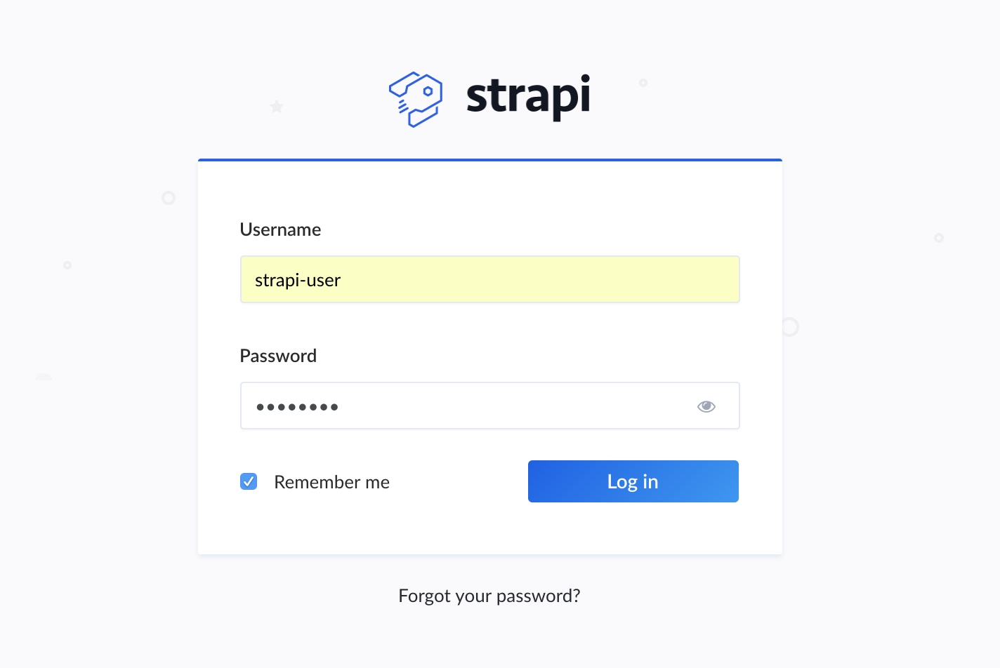
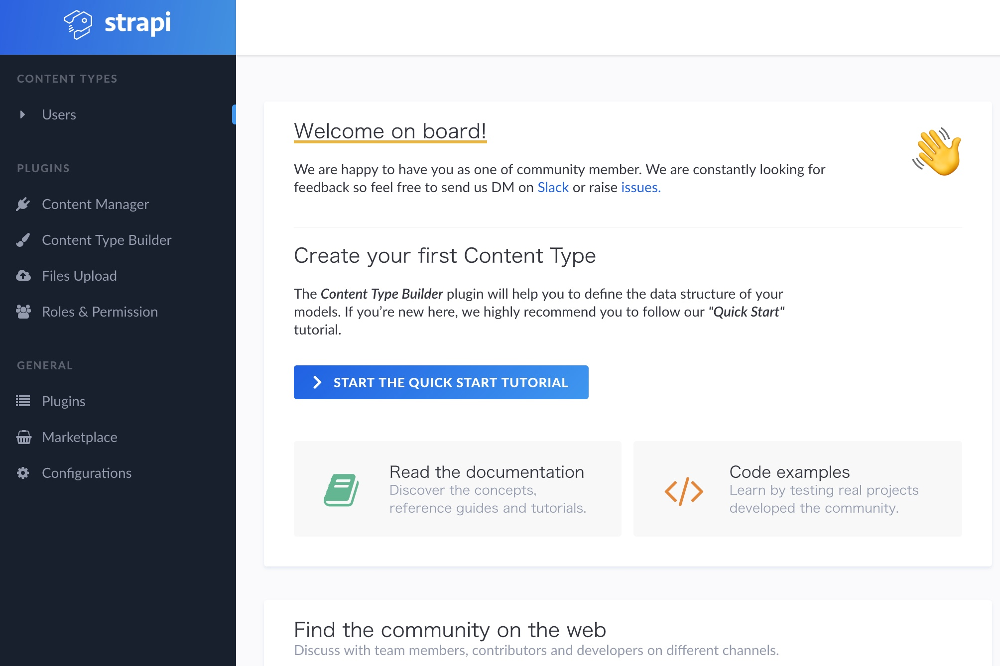

strapi日本語インテグレーションガイド(クライアント側はreactを使用)  
  
  
# Contents

1. 前提の環境  
1. strapiをインストールする(グローバル)
1. strapi newコマンドでプロジェクトをスタートする --> ここまでコミット https://github.com/eysmnje/strapi-examples/commit/c8f05f810555b79448d5aae86f6c10b83a0813f4
1. cd login-sample して、strapi start してみる
1. ブラウザで http://localhost:1337/admin にアクセスしてみる

# links

1. https://qiita.com/eysmnje/items/d873c0a90501b318691d
  
  
## このサンプルで使用している環境
  
```
記入時点のバージョン

node -v
v10.9.0

mongo -version
v4.0.0

strapi -v
3.0.0-alpha.14
```
  
## strapiをインストールする(グローバル)

```
npm install strapi@alpha -g
```

```
strapi new <project-name>

ここでは
strapi new login-sample
```

#### 設定のサンプル ↓
  
```
ここで失敗する場合はMongoDBとの接続がうまくいかない場合

? Choose your main database: MongoDB (recommended)
? Database name: some-mongo-db
? Host: 127.0.0.1
? +srv connection: false
? Port (It will be ignored if you enable +srv): 27017
? Username: strapi-user
? Password: password
? Authentication database: some-mongo-db
? Enable SSL connection: false
```

#### ここまでのコミット (すごくいっぱい)
https://github.com/eysmnje/strapi-examples/commit/c8f05f810555b79448d5aae86f6c10b83a0813f4

## cd login-sample して、strapi start してみる
```
cd login-sample
strapi start
```

#### こんな感じで起動
```
strapi start

[前部分省略]

[2018-08-29T09:13:18.374Z] info Time: Wed Aug 29 2018 18:13:18 GMT+0900 (GMT+09:00)
[2018-08-29T09:13:18.376Z] info Launched in: 5479 ms
[2018-08-29T09:13:18.376Z] info Environment: development
[2018-08-29T09:13:18.376Z] info Process PID: 62891
[2018-08-29T09:13:18.376Z] info Version: 3.0.0-alpha.14 (node v10.9.0)
[2018-08-29T09:13:18.376Z] info To shut down your server, press <CTRL> + C at any time

[2018-08-29T09:13:18.376Z] info ☄️  Admin panel: http://localhost:1337/admin
[2018-08-29T09:13:18.376Z] info ⚡️ Server: http://localhost:1337

[2018-08-29T09:13:22.958Z] info File changed: /strapi-examples/ja-integration-guide-with-react-client-login-sample/login-sample/plugins/users-permissions/config/actions.json
```
  
## ブラウザで http://localhost:1337/admin にアクセスしてみる
  
ログイン画面

  
トップ画面

